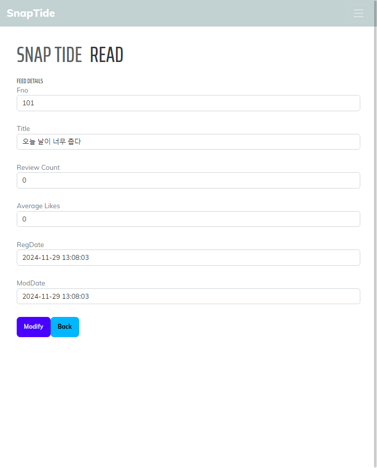

# 🌊 SnapTide

사진 기반 **소셜 플랫폼 (SNS)** 으로, 사용자가 사진을 공유하고 댓글을 통해 소통할 수 있는 풀스택 웹 애플리케이션입니다.  
Spring Boot 기반 REST API 서버와 React(TypeScript) 클라이언트로 구성되었습니다.  

이 프로젝트는 **회원 인증 → 피드 CRUD → 이미지 업로드 → 검색/필터링 → 반응형 UI**까지 웹 서비스의 전 과정을 직접 구현한 개인 포트폴리오용 프로젝트입니다.

## 내가 개발한 부분

이 프로젝트는 **개인 프로젝트**로, 서버(Spring Boot)와 클라이언트(React) 전 과정을 직접 구현했습니다.

* **Backend**

  * JWT 기반 회원 인증/인가 (Spring Security)
  * 피드 CRUD API + 페이징 처리
  * 다중 이미지 업로드/삭제 (MultipartFile, UUID 기반 파일 관리)
  * 리뷰(댓글) CRUD 기능
  * Swagger(OpenAPI) 설정 및 예외 처리(ControllerAdvice)

* **Frontend**

  * 로그인/회원가입 UI + 토큰 관리(sessionStorage)
  * 피드 등록/수정/삭제/조회 화면 + 이미지 업로드 기능
  * 키워드 검색, 카테고리 필터링, 페이징 처리
  * 반응형 UI (Bootstrap + Tailwind CSS)
  * Fetch API 기반 서버 연동

## 학습 포인트 & 성과

* Spring Security와 JWT를 활용한 **인증/인가 전 과정을 직접 구현**
* **REST API 설계부터 React 클라이언트 연동까지 엔드투엔드 개발 경험**
* 다중 이미지 업로드와 페이징, 예외 처리 등 **실무 서비스에 가까운 기능 구현**
* Swagger를 통한 API 문서화 및 Docker 기반 실행 환경 구성 경험

## 🛠️ 기술 스택

| 구분 | 사용 기술 |
|------|-----------|
| **Backend** | Java 17, Spring Boot 3.x, Spring Data JPA, Spring Security (JWT), Spring Validation, Swagger (springdoc-openapi), MySQL / H2, Maven |
| **Frontend** | React 18+, TypeScript, React Router, Bootstrap / Tailwind CSS, Fetch API, JWT 인증 |
| **Infra / Tools** | Docker / Docker Compose, GitHub Actions (CI/CD), IntelliJ, VSCode |

## 🚀 주요 기능

| 구분 | 기능 |
|------|------|
| 회원 관리 | 회원 가입, 로그인, 권한(Role) 관리 |
| 인증 처리 | JWT 토큰 기반 인증/인가, 세션 유지 |
| 피드 관리 | 피드 등록, 수정, 삭제, 조회, 페이징 처리 |
| 리뷰 관리 | 피드·사진에 대한 리뷰 CRUD |
| 사진 업로드 | Multipart 파일 업로드 및 URL 반환 |
| UI/UX | 반응형 디자인, 사진 목록·검색·필터링 |
| 예외 처리 | ControllerAdvice 기반 전역 예외 처리 |

## 🧱 ERD 다이어그램
```text
Members (회원)
 ├── id (PK)
 ├── email
 ├── password
 ├── nickname
 └── roles (ManyToMany) ──▶ MembersRole

Feeds (피드)
 ├── id (PK)
 ├── title
 ├── content
 ├── member_id (FK) ──▶ Members

Reviews (리뷰)
 ├── id (PK)
 ├── content
 ├── member_id (FK) ──▶ Members
 └── feed_id (FK) ──▶ Feeds

Photos (사진)
 ├── id (PK)
 ├── uuid
 ├── fileName
 ├── uploadPath
 └── review_id (nullable, FK) ──▶ Reviews
````
## 📂 프로젝트 구조

```plaintext
snapTide/
├── backend/                 # Spring Boot API 서버
│   ├── src/
│   ├── target/snapTide-api.jar
│   ├── Dockerfile
│   └── pom.xml
│
├── frontend/                # React 클라이언트
│   ├── src/pages/
│   │   ├── Login.tsx
│   │   ├── Join.tsx
│   │   ├── List.tsx
│   │   ├── Read.tsx
│   │   ├── Modify.tsx
│   │   └── Register.tsx
│   ├── Dockerfile
│   └── package.json
│
├── docker-compose.yml
└── README.md
```
## 📘 Swagger & 라우팅

* **Swagger UI**

  ```
  http://localhost:8080/swagger-ui/index.html
  ```

* **Frontend 주요 라우팅**

  | 경로                   | 설명          |
  | -------------------- | ----------- |
  | `/feeds/list`        | 피드 리스트 및 검색 |
  | `/feeds/register`    | 새 피드 작성     |
  | `/feeds/read?fno=1`  | 피드 상세 보기    |
  | `/feeds/modify/:fno` | 피드 수정       |
  | `/login`             | 사용자 로그인     |
  | `/join`              | 회원가입        |

## ⚙️ 실행 방법

### 1. Docker Compose 실행 (권장)

```bash
docker-compose up --build
```

* API 서버: [http://localhost:8080](http://localhost:8080)
* Frontend: [http://localhost:3000](http://localhost:3000)

### 2. 수동 실행

#### Backend

```bash
cd backend
./mvnw spring-boot:run
```

#### Frontend

```bash
cd frontend
npm install
npm start
```
## 📸 주요 화면 (UI 캡처)

| 기능 | 화면 1 | 화면 2 | 화면 3 |
|------|--------|--------|--------|
| **회원 인증** | <br/>로그인 페이지 | <br/>로그인 성공 → 메인 이동 | <br/>유효성 검사 |
| **피드 등록 & 목록** | <br/>게시글 등록 | <br/>이미지 없는 등록 | <br/>다중 이미지 등록 |
| **피드 조회 & 수정/삭제** | <br/>게시글 상세 | <br/>게시글 수정 | <br/>게시글 삭제 |
| **검색 & 필터링** | <br/>카테고리 필터링 | <br/>키워드 검색 | <br/>검색 결과 |
| **피드 상세 & 수정 완료** | <br/>READ 화면 | <br/>수정 완료 | <br/>이미지 없는 등록 |
| **반응형 페이지** | <br/>991px 이하 화면 | <br/>피드 리스트 & 페이징 | <br/>검색·필터링 지원 |

## 🔮 향후 개선 방향

* AWS S3 연동을 통한 이미지 업로드 클라우드화
* WebSocket 기반 실시간 알림(Notification) 기능 추가
* Docker + GitHub Actions 기반 자동 배포 파이프라인 고도화
* 반응형 UI 개선 및 모바일 최적화 강화

